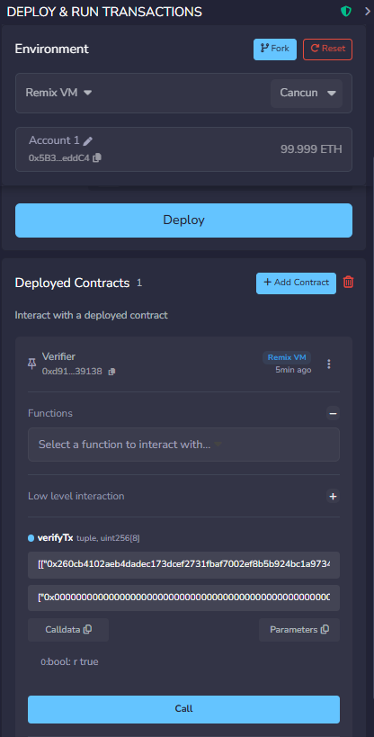
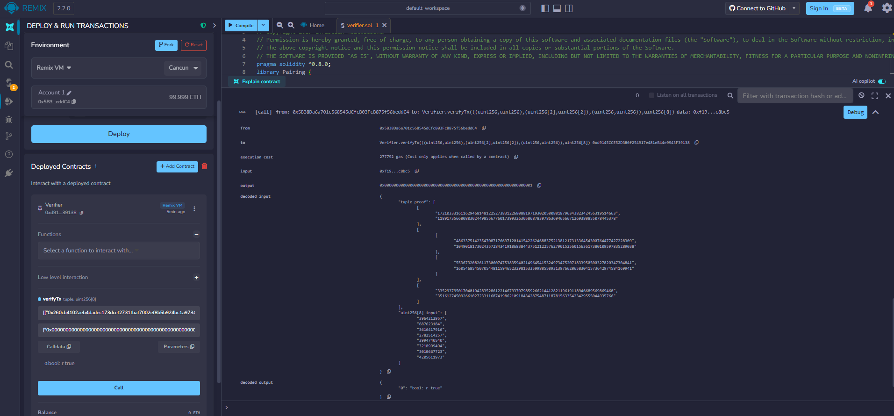

# Лабораторная работа 1. ZoKrates: доказательство знания прообраза хеш-значения

## Цель работы

Реализовать программу на языке ZoKrates, проверяющую знание прообраза хеш-значения SHA256, сгенерировать доказательство с нулевым разглашением, создать смарт-контракт верификатор и проверить его работу в Remix IDE.

## Используемые инструменты

- ZoKrates 0.8 (запуск через Docker)
- SHA256 (256bitPadded) — встроенная хеш-функция ZoKrates
- Groth16 — схема доказательства
- BN128 — эллиптическая кривая
- Remix IDE — развёртывание и проверка верификатора

## Описание программы

Файл `hash_preimage.zok` реализует схему: доказывающий знает секретный прообраз (`preimage`) такой, что `SHA256(preimage) == hash`, не раскрывая сам прообраз. Параметр `preimage` помечен как `private` — он не попадает в доказательство.

## Порядок выполнения

### 1. Компиляция программы
```bash
docker run --rm -v "$(pwd):/home/zokrates/code" -w /home/zokrates/code \
  zokrates/zokrates zokrates compile -i hash_preimage.zok
```
Результат: файлы `out` и `out.r1cs` (схема R1CS, 26832 ограничений)

### 2. Генерация ключей (Setup)
```bash
docker run --rm -v "$(pwd):/home/zokrates/code" -w /home/zokrates/code \
  zokrates/zokrates zokrates setup
```
Результат: `proving.key`, `verification.key`

### 3. Вычисление witness
Прообраз: `[0, 0, 0, 0, 0, 0, 0, 1]` (8 значений u32)
SHA256 прообраза: `[3964212957, 687623184, 3616417916, 2782514257, 3994740540, 3218999494, 3010667723, 4205611973]`

```bash
docker run --rm -v "$(pwd):/home/zokrates/code" -w /home/zokrates/code \
  zokrates/zokrates zokrates compute-witness -a \
  0 0 0 0 0 0 0 1 \
  3964212957 687623184 3616417916 2782514257 3994740540 3218999494 3010667723 4205611973
```
Результат: файл `witness`

### 4. Генерация доказательства
```bash
docker run --rm -v "$(pwd):/home/zokrates/code" -w /home/zokrates/code \
  zokrates/zokrates zokrates generate-proof
```
Результат: `proof.json`

### 5. Экспорт смарт-контракта верификатора
```bash
docker run --rm -v "$(pwd):/home/zokrates/code" -w /home/zokrates/code \
  zokrates/zokrates zokrates export-verifier
```
Результат: `verifier.sol`

### 6. Развёртывание и проверка в Remix IDE

1. Открыть [remix.ethereum.org](https://remix.ethereum.org)
2. Создать новый файл `verifier.sol` и вставить содержимое сгенерированного файла
3. Скомпилировать (Compiler → Solidity 0.8)
4. Задеплоить контракт `Verifier` (Deploy & Run → JavaScript VM)
5. Вызвать функцию `verifyTx` со значениями из `proof.json`

Аргументы для `verifyTx`:
```
a: ["0x260cb4102aeb4dadec173dcef2731fbaf7002ef8b5b924bc1a97346509819827",
    "0x1a4a7bded2ecb74bd60cf74538dede4bdc9ac2cbc872b737ea182819e759e142"]

b: [["0x0ac092a1e945f9ba40cd5f997f6e57bee5743f512be9fb5de5ec5e2cce731e95",
     "0x17313b81f4dc0df9521e718367ef30f0b6751bc41da8d6b8a22463995d9461ce"],
    ["0x0c3dade6f48fb9a79cb21e19ce2e15e0a790b7bb6732becaa1d187c7adc3eb89",
     "0x038ca9ba05675deed21b57719b26c0bff5e99d749e4cafdc94d5fb5b4b60e5d5"]]

c: ["0x0769b214ad2c0a83eb9be5140e6bdc864df0e0f8d232666b4938a2eac8314e94",
    "0x07c60ebfacffd4c0ab805d8260e8ca67eab17071ab11e1468c14c6891336e856"]

input: ["0x00000000000000000000000000000000000000000000000000000000ec4916dd",
        "0x0000000000000000000000000000000000000000000000000000000028fc4c10",
        "0x00000000000000000000000000000000000000000000000000000000d78e287c",
        "0x00000000000000000000000000000000000000000000000000000000a5d9cc51",
        "0x00000000000000000000000000000000000000000000000000000000ee1ae73c",
        "0x00000000000000000000000000000000000000000000000000000000bfde08c6",
        "0x00000000000000000000000000000000000000000000000000000000b37324cb",
        "0x00000000000000000000000000000000000000000000000000000000faac8bc5"]
```

## Результат верификации в Remix IDE

Вызов `verifyTx` вернул `true` — доказательство корректно проверено смарт-контрактом:



Детали вызова в консоли Remix (`decoded output: "bool: r true"`):



## Файлы репозитория

| Файл | Описание |
|---|---|
| `hash_preimage.zok` | Программа ZoKrates |
| `compute_hash.py` | Скрипт вычисления SHA256 в формате u32 |
| `proof.json` | Сгенерированное доказательство (Groth16) |
| `verifier.sol` | Смарт-контракт верификатор |
